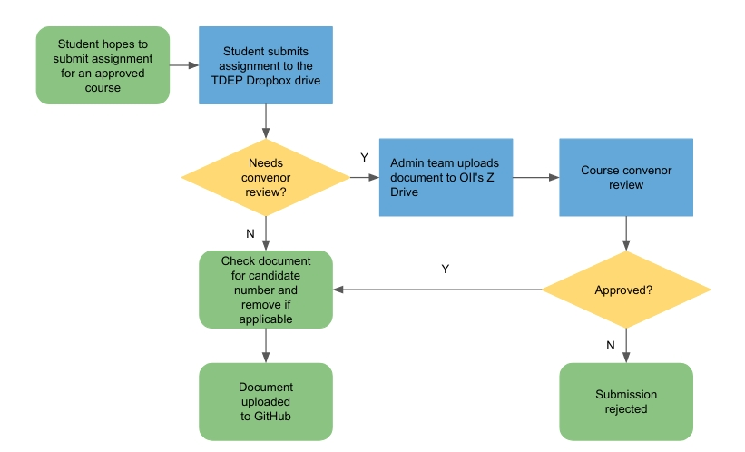

## Procedure document for the TDEP project - for course administrator and convenors

The Teaching Development and Enhancement Project (TDEP) Coding Resources Project aims to build a clear avenue where students and alumni and share their working code, coding best practices, the code from their thesis, or prior answers to formatives. This will take form of a GitHub repository whereby all on-course students are able to learn from those who came before them. 

This document hereby serves as a procedure document for course administrators and course convenors who hope to take part in the document. 

### Structure of the project

As mentioned, the TDEP project takes the form of a private GitHub repo that was granted access to OII current students, staff and alumni, which can be found [here](https://github.com/oii-TDEP). It is organized as follows:

- An 'admin' repository, which contains admin files, including FAQ and license document of how and why the project is taking place, as well as instruction for user and maintanence team of the project.
- Repositories for courses and master theses, where those acutal working code and pass assignments from students and alumni goes into. Under every course repo there is a list of nested folder that are designed for each year's cohort. 
  - Prior to the setting up of those courses, verbal consent was collected from courses convenors. 

### Procedure of assignment sharing

The procedure of sharing an assignment is currently as follows.

### FAQ and other materials

You may find further information about this project here. For further information:

Please contact coderesources@oii.ox.ac.uk.

